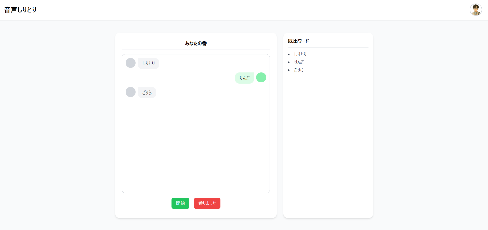

# 音声認識×しりとりWebアプリ（ローカル動作）

## 🎮 概要
ブラウザ上で音声認識と音声合成を使ってしりとりを行うアプリです。  
ユーザーの発話をリアルタイムで認識し、ルールに従って次の単語を返すことで、
「人と話すようなしりとり体験」を目指しました。  
ローカル環境で動作し、サーバー通信なしで完結します。

### UIの画像
JSも連携できたので
動画は...お待ちください...

---

### :loud_sound:お知らせ
現在、[別リポジトリ](https://github.com/Hiiragi303/shiritori_fullstack)でフルスタック化に挑戦しています。  
ChatGPTを用いて学び、小さく実装しつつ、最終的にはこの音声しりとりの機能を取り入れる予定です。

---

## 🎯 開発目的
単なる遊びではなく、音声UIを技術的に理解するための個人開発です。  
特に、非同期処理・音声認識API・日本語形態素解析の扱いを体感的に学ぶことを目的としました。  
「UI/UXを技術で遊ぶ」ことを意識し、自然な会話のテンポを再現する工夫をしています。  
また、ゼミで発表する機会があったため、ゼミの仲間に楽しんでもらいたいと思い作成しました。  

---

## 🛠 使用技術
- 言語: JavaScript / HTML / ~~CSS~~ TailWind CSS(**new**)
- ライブラリ: SpeechRecognition API, SpeechSynthesis API, kuromoji.js
- データ: MeCab名詞辞書（CSV）
- 実行環境: ブラウザ（Chrome推奨）, Windows11, Mac(M2チップ)
- インフラ: ローカルのみ（バックエンドなし）

Web Speech APIの２つは、ユーザーの音声認識、コンピュータの音声出力のために用いています。
kuromoji.jsは、形態素解析を用いて、音声認識の漢字やひらがな混じりのテキストを全てカタカナに統一するため、名詞の判定を行うため用いました。
MeCab辞書を用いてコンピュータ側がランダムに回答を選べるようにしました。

---

## 🔧 主な機能
- ユーザーの発話をリアルタイムで認識
- 認識された単語をカタカナ変換し、整合性のチェック
- 認識された単語の最後の文字に合う単語を辞書から抽出
- 抽出された中からランダムで音声合成を用いて返答
- ユーザーの発話を受け付け
- しりとりの終了条件（「ん」で終わる、語彙の重複など）を判定
- プログラム側が単語を見つけられなかった場合「まいりました」と音声出力
- ユーザーが終了したとき(降参したとき)、「どやぁ！」と音声出力

---

## 💡 設計の工夫ポイント
- **形態素解析（kuromoji.js）** を使用し扱う文字列を全てカタカナに統一し判定を確実に
- ゲームロジックをわかりやすく分離し、可読性と拡張性を意識したファイル構成と実装に
- MeCab辞書を用いることで、ある程度のしりとりができるように
- 辞書の用意、録音の準備などの初期化を完全に完了させてからゲーム開始出来るように
- 音声入力受付中の無言中にマイクが切れないように
- プログラム側が返答出来なかった場合、「まいりました」と発言させ無言で終わらないように
- 音声認識で検出した語が分かるようにUIでFBできるように
- しりとりのやりとりをチャット形式で表示できるように
- 既出語が分かりやすいようにリストに
- MVCの考えを導入しより処理依存を少なく簡潔に
- ESModuleの強みでモジュール内の変数で状態管理を簡潔に

---

## 🌱 学びと成果
新しく学ぶ技術でも実装可能であることが実感できました。  
async/await の理解が深まり、非同期の流れを意識して設計できるようになりました。  
音声処理を通して、技術で遊ぶ発想の大切さを実感できました。

ゼミの発表で、仲間を楽しませることが出来ました。  
しりとりをCUIでなく音声UIで実装した点や、  
終了時の「まいりました」という音声が高評価を受けました。  

**小さな遊び心と工夫によってユーザーに笑顔を届けたいと思うようになったきっかけとなりました**。

---

## 📝 今後の改善点
- コンピュータがより自然な名詞を返すように
- UIデザインの改善 ~~現在はシンプルなUI~~
- ~~現在コンソールでしか確認できない文字としての返答をUI上で表示~~
- ~~「っ」や「ー」などで終了する語への対応~~
- ~~リトライ機能の追加~~
- 音声認識の精度調整(Web Speech APIだと難しい...)
- 非同期処理が難しい

---

## ✨ 更新内容
- UIを改善しました
- JSのコードをリファクタリングしました

---
## 💬コメント
見てくださりありがとうございます。
今回用いた音声認識、音声合成、kuromoji.jsは当時初めて利用しました。
またGit,GitHubも初めてこの制作物で利用しました。
GitHubはWindowsとMac両方でコーディングするために利用しました。（一人でさみしく）
夜中にニヤけながら作ってました。
最初作っていた当時は、npmなんて微塵も知りませんでした。（白目）
[Next.js化](https://github.com/Hiiragi303/shiritori_fullstack)がんばるぞー、です。
（10/26追記）
最近夜22時くらいから朝の6時くらいまでこの実装してます
何故か音声出力が不安定だったり、ボタンで途中割り込みの処理が難しいです。
真夜中に一人でしりとりをしている...w
ちょっとでもこの作品良いなって思っていただけたらとても嬉しいです
[ShootingGame](https://github.com/Hiiragi303/ShootingGame)でデモ動画あるので良ければ見て言ってください^^